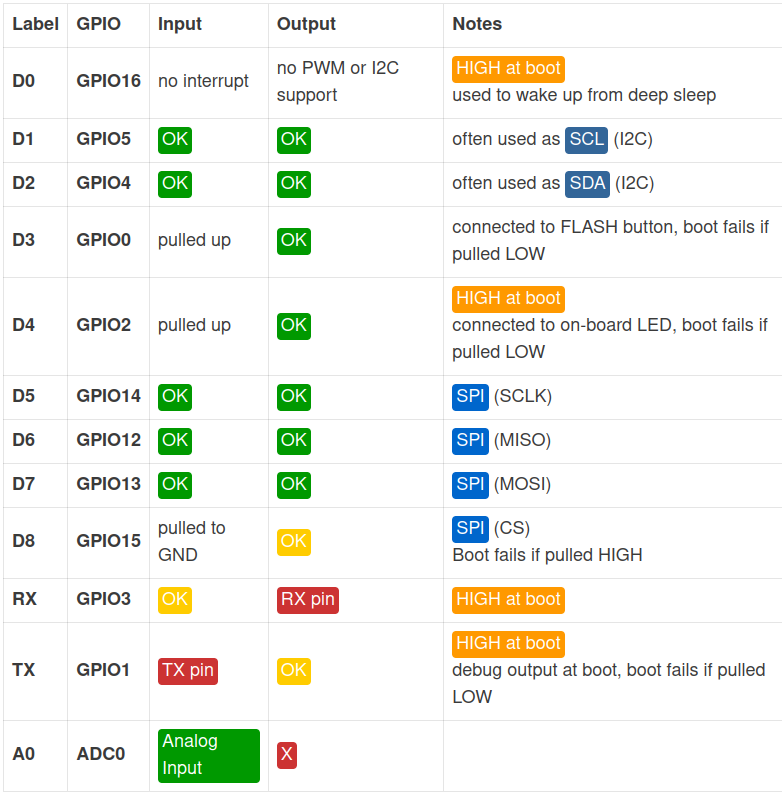

# NodeMCU Pinout




# Arduino Client

- [Link github de arduino-cli](https://github.com/arduino/arduino-cli)

  - [Link Instalacion](https://arduino.github.io/arduino-cli/latest/installation)
  - [Link Getting Started](https://arduino.github.io/arduino-cli/latest/getting-started/)

**Configuartion File:** `nano ~/.arduino15/arduino-cli.yaml`

Lista de cores para arduinos avr:

--------------------------------------------------------------------------------

## Instalacion

```bash
arduino-cli core install arduino:avr
```

### Lista de Cores

#### AVR

```
  arduino:avr:uno
  arduino:avr:pro:cpu=8MHzatmega168
  arduino:avr:pro:cpu=16MHzatmega168
  arduino:avr:pro:cpu=8MHzatmega328
  arduino:avr:pro:cpu=16MHzatmega328
  arduino:avr:nano:cpu=atmega168
  arduino:avr:nano:cpu=atmega328
  arduino:avr:nano:cpu=atmega328old
  arduino:avr:atmegang:cpu=atmega168
  arduino:avr:atmegang:cpu=atmega8
  arduino:avr:leonardo
  arduino:avr:mega:cpu=atmega2560
  arduino:avr:mega:cpu=atmega1280
```

#### ESP8266

1. Ir a `nano ~/.arduino15/arduino-cli.yaml` y copiar link del esp8266:

  ```yaml
  board_manager:
  additional_urls:
  - https://arduino.esp8266.com/stable/package_esp8266com_index.json
  ```

2. Actualizar index con `arduino-cli core update-index`. Y ver lista de instalados con `arduino-cli core search esp8266`

3. Instalar placas con `arduino-cli core install esp8266`

4. Ver listado `arduino-cli board listall esp8266`

#### ESP32

1. Ir a `nano ~/.arduino15/arduino-cli.yaml` y copiar link del esp32:

  ```yaml
  board_manager:
  additional_urls:
  - https://dl.espressif.com/dl/package_esp32_index.json
  ```

2. Actualizar index con `arduino-cli core update-index --config-file arduino-cli.yaml`.

  Y ver lista de instalados con `arduino-cli core search esp32`

3. Instalar placas con `arduino-cli core install esp32:esp32`

4. Ver listado `arduino-cli board listall esp32`

### Instalar Librerias

```bash
# Ejemplo Buscar
arduino-cli lib search PubSubClient
```

```bash
# Instalar
arduino-cli lib install PubSubClient
```

## Compilar y Subir Codigo

```bash
# Crear sketch
arduino-cli sketch new codigo_esp2866

# Compilar Codigo
arduino-cli compile --fqbn esp8266:esp8266:nodemcuv2 codigo_esp2866

# Subir Codigo
arduino-cli upload -p /dev/ttyUSB0 --fqbn esp8266:esp8266:nodemcuv2 codigo_esp2866
```

### Permisos de Puerto

Si da un error de que no puedes acceder al puerto, entonces : `sudo chmod a+rw /dev/ttyUSB0` con el puerto en cuestion.

En nuestro caso:

```bash
sudo chmod a+rw /dev/ttyACM0
sudo chmod a+rw /dev/ttyUSB0

sudo usermod -a -G dialout carlos
```

[Link de la solucion.](https://forum.arduino.cc/t/permission-denied-on-dev-ttyacm0/475568/5)

## Leer Del Serial

Para leer del serial ejecutar:

```bash
# kill all running putty processes to free the serial port
sudo killall putty
# start putty
# & causes it to run in the background so it doesn't block the terminal
sudo putty /dev/ttyUSB0 -serial -sercfg 115200,8,n,1,N
```
